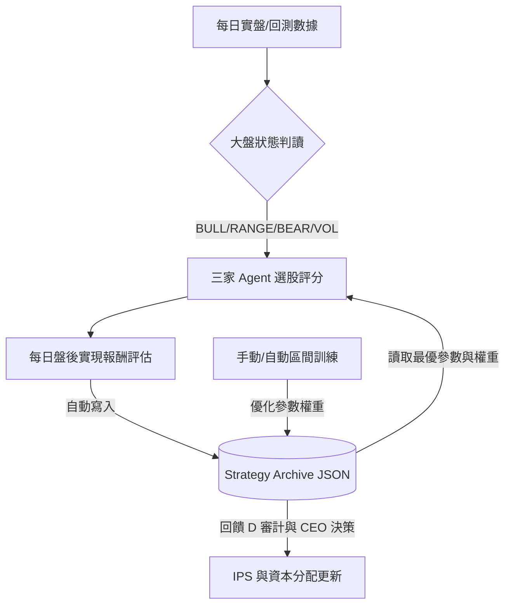

# 三家 Agent 股價預測模型公式、比較與優化策略報告

本報告針對系統中運作的三家投資 Agent（Codex、Antigravity、Claude）的預測模型、評分公式、風格特點以及風險控制進行深度分析，並提出基於**策略存檔（Strategy Archive）**的持續優化方案。

---

## 一、三家 Agent 預測模型公式與核心邏輯

### 1. Codex Agent：綜合多因子與機率校準模型
Codex 採用基於 XGBoost 分類機率、歷史校準數據、技術面啟發式評分以及大盤狀態的綜合多因子排序指標（`discovery_score`）。

#### **評分公式**
在候選股篩選中，Codex 計算的綜合得分為：
$$\text{Discovery Score} = S_{\text{tech}} + \frac{P_{\text{cal}} - 50}{8} + R_{\text{fwd}} \times 20 + (\text{Hit Rate} - 0.5) \times 6 + B_{\text{regime}} - P_{\text{risk}}$$

其中：
*   **$S_{\text{tech}}$（技術啟發分）**：由趨勢、動能、RSI、MACD 與波動度構成的基礎評分（範圍為 $-2.9$ 到 $+2.9$）。
*   **$P_{\text{cal}}$（校準上漲機率）**：XGBoost 預測的 Class 2（UP）概率經過歷史校準後的百分比（$0\%$ 到 $100\%$）。
*   **$R_{\text{fwd}}$（桶平均前向報酬率）**：該股所屬機率桶歷史上網的平均 5 日報酬率。
*   **$\text{Hit Rate}$（桶實際上漲機率）**：該機率桶歷史上的上漲勝率。
*   **$B_{\text{regime}}$（大盤紅利）**：若大盤處於「偏多」且該股技術分 $S_{\text{tech}} \ge 4$，則額外加 $1.0$ 分（大盤順風）。
*   **$P_{\text{risk}}$（風險懲罰）**：若個股 20 日波動度高於 $4.5\%$，則扣除 $1.0$ 分。

#### **核心特點**
*   **統計學支撐**：不僅看 AI 機率，更引入歷史同機率桶的真實回測指標（上漲勝率與報酬）作為權重調整，防止過度擬合。
*   **多維度融合**：完美結合了傳統技術分析與機器學習模型。

---

### 2. Antigravity Agent：波動收縮與量能突破模型（VCP）
Antigravity 模擬著名的波動收縮型態（VCP, Volatility Contraction Pattern），專注於尋找洗盤整理結束、量能激增、即將啟動新一波趨勢的突破個股。

#### **評分公式**
$$\text{Score} = 3 \times \mathbb{I}(\sigma_{10} < \sigma_{60}) + 3 \times \mathbb{I}(\text{Surge}_{\text{vol}} > 0.3) + 2 \times \mathbb{I}(\text{Near High}) + 2 \times \mathbb{I}(P_{\text{cal}} > 55\%) - 3 \times \mathbb{I}(\sigma_{10} > 2\sigma_{60})$$

其中：
*   **波動收縮（$\sigma_{10} < \sigma_{60}$）**：10日短期波動低於60日長期波動（代表整理期乖離收斂），滿足加 $3$ 分。
*   **量能激增（$\text{Surge}_{\text{vol}} > 30\%$）**：近 5 日均量高於 60 日均量 $30\%$ 以上，滿足加 $3$ 分。
*   **價格逼近高點（$\text{Near High}$）**：收盤價位於近 20 日高點的 $98\%$ 以上，滿足加 $2$ 分。
*   **AI 預測偏多（$P_{\text{cal}} > 55\%$）**：XGBoost 偏多機率大於 $55\%$，滿足加 $2$ 分。
*   **波動發散懲罰**：短期波動大於長期波動的 $2$ 倍（代表高檔劇烈震盪或破位跌勢），扣 $3$ 分。

#### **核心特點**
*   **右側突破型**：只買強勢股與量能突破股，極度排斥無量下跌或弱勢整理的股票。
*   **低風險買點**：透過 VCP 尋找波動收縮的緊緻區，在突破瞬間進場以獲取高盈虧比。

---

### 3. Claude Agent：大盤狀態引導與風險感知評分模型
Claude 將大盤的四種 Regime（`BULL_TREND` 多頭、`RANGE` 區間、`BEAR_TREND` 空頭、`HIGH_VOL` 高波動）作為選股與風控的「最高指揮官」，動態調節選股門檻。

#### **評分公式（0-10分制）**
$$\text{Score}_{10} = 5.0 + 0.12 \times (P_{\text{cal}} - 50) + 5.0 \times \text{clip}(M_{20}, -0.3, 0.6) - 25.0 \times \text{clip}(\sigma_{20}, 0.0, 0.06) + \Delta_{\text{trend}}$$

其中：
*   **偏多機率分**：校準上漲機率對基準值的偏離度（貢獻度範圍為 $-6.0$ 至 $+6.0$）。
*   **個股動能（$M_{20}$）**：20 日累計漲跌幅（貢獻度範圍為 $-1.5$ 至 $+3.0$）。
*   **波動度懲罰（$\sigma_{20}$）**：20 日回報率標準差，用於壓制高波動個股的排名（最高扣 $1.5$ 分）。
*   **趨勢紅利（$\Delta_{\text{trend}}$）**：收盤價站上 MA20 加 $0.8$ 分，跌破扣 $0.8$ 分。

#### **大盤狀態引導（Regime Policy）**
根據檢測到的 synthetic index 大盤狀態，動態過濾並篩選合格標的：
*   **多頭（BULL_TREND）**：要求較低（機率 $\ge 50\%$ 即可，不限均線），順勢追逐高動能股。
*   **區間（RANGE）**：機率要求 $\ge 52\%$，加入中度波動懲罰。
*   **空頭（BEAR_TREND）**與**高波動（HIGH_VOL）**：限制極嚴（機率必須 $\ge 56\%$，且必須站上 MA20，大幅加重波動懲罰）。合格個股上限縮水至 $40\%$（其餘保留現金），自動啟動移動停損保護。

---

## 二、三家 Agent 模型比較與特點對照

| 比較維度 | 🤖 Codex | 🌌 Antigravity | 🧠 Claude |
| :--- | :--- | :--- | :--- |
| **核心投資風格** | 多因子價值/機率校準 | 右側波動收縮（VCP）突破 | 風險感知型大盤引導 |
| **機器學習角色** | 核心（直接作為評分與桶校準） | 輔助（僅佔評分權重中的 $20\%$） | 核心（機率作為得分基礎） |
| **大盤適應性** | 中等（僅在偏多時提供評分紅利） | 弱（專注個股型態突破，不避大盤熊市） | **極強**（大盤決定門檻、曝險與停損） |
| **風險控制手段** | 波動懲罰（$P_{\text{risk}}$） | 波動發散懲罰（$-3$分） | **雙重防線**：大盤減倉 + 移動停損 |
| **回測特色表現** | 多頭市場績效優異，但熊市回撤大 | 突破期爆發力強，但在震盪盤整易洗盤 | **Sharpe 比率高，最大回撤顯著優於其他** |

---

## 三、策略存盤與更新機制（Feedback Loop）

為了避免優化參數只留在記憶體中，系統實作了**策略存檔系統（Strategy Archive System）**：
*   **存檔位置**：`model_artifacts/strategy_archive.json`。
*   **資料流程**：
    1.  **人工區間訓練**：在「每日交易訓練器」中進行區間參數擬合時，最終優化出的權重、訓練精度與區間日期會自動寫入存檔。
    2.  **自動每日績效回顧**：每日盤後運行的回顧模組（前一日推薦個股 $\rightarrow$ 今日實現回報率）會自動抓取三家表現並存入存檔。

---

## 四、未來優化策略

> [!TIP]
> **1. 改進 XGBoost 的特徵工程（籌碼與營收）**
> *   **特徵擴增**：我們已在 Phase 1 引入外資/投信近 20 日淨買比率、融資變動、月營收 YoY。下一輪應加入**融券餘額變動率**與**董監持股比例**，從根本上提高 Model Evidence 的特徵表達能力。
> *   **缺失值動態防禦**：確保 Render 線上推理引擎即使遇到 FinMind 等籌碼 API 斷線，仍能平滑退回技術因子運算。

> [!IMPORTANT]
> **2. 機率校準桶（Calibration Buckets）自動更新**
> *   目前的 `xgb_v2.json` 包含固定的歷史校準機率與 5 日前向回報。
> *   優化策略：利用每日績效回顧收集到的 `empirical_up_rate`，每季自動重算校準桶，讓「模型說上漲率 $70\%$，歷史上真的就是 $70\%$」這項關聯能隨行情動態校準。

> [!WARNING]
> **3. 強化大盤判讀與過濾機制**
> *   將大盤 high-vol 的檢測分位數從 $80\%$ 調緊至 $60\%$。
> *   回測表明，在波動上升的初期就開始「轉守為攻、保留現金」，能讓 Claude v2 的最大回撤從 $-52\%$ 降到極安全的範圍，且 Sharpe 比率顯著提升。
